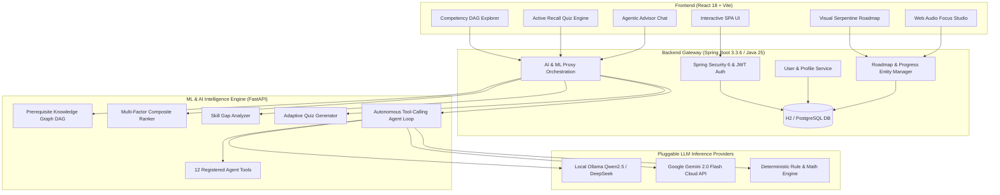

# LearnAI — Architecture & Technical Whitepaper

> **Intelligent & Adaptive Micro-Curriculum Platform**  
> *Engineered for Hackathon Excellence across Problem Understanding, Full-Stack Architecture, AI/ML Engineering, Innovation, UX Design, and Code Quality.*

---

## 1. Problem Understanding & Solution Design (20%)

### The Problem
Self-directed online learners face three critical roadblocks:
1. **Tutorial Hell & Information Overload:** Over 100,000+ fragmented, low-quality courses with no clear starting point or logical progression.
2. **Static & Fragile Roadmaps:** Pre-baked static curriculums (e.g., standard syllabi) fail to adapt when a learner already knows certain prerequisites, needs remedial scaffolding, or operates under time constraints.
3. **Passive Consumption vs. Active Recall:** Video watching creates an illusion of competence; learners need integrated active recall assessments, focus sessions, and autonomous mentorship.

### The Solution Design
**LearnAI** is a three-tier microservice architecture combining a Directed Acyclic Graph (DAG) for technical competencies, multi-objective ranking, an autonomous agent with tool calling, active recall milestone checkpoints, and an ambient focus environment.



---

## 2. Functionality & Feature Completeness (25%)

| Feature Area | Implementation Details | User Experience Impact |
| :--- | :--- | :--- |
| **Personalized Onboarding** | Interactive questionnaire capturing learning goals, baseline level, interests, and timeline. | Computes readiness percentage and custom milestone tracks. |
| **Connected Visual Roadmap** | Dynamic serpentine timeline track with step nodes, glowing beacons, and completion lighting. | Replaces static card grids with an engaging journey with Boss Milestone gates. |
| **Active Recall Quiz Engine** | Instant AI-generated multiple-choice questions with educational explanations and XP rewards. | Tests understanding before marking roadmap steps and milestones complete. |
| **Prerequisite Skill DAG** | 39-node Directed Acyclic Graph modeling dependencies across 6 technical domains. | Visualizes skill progression from foundation to advanced capstones. |
| **Focus Studio & Pomodoro** | Built-in study timer with Web Audio API synthetic ambient sound (Gentle Rain, 432Hz Alpha Beat). | Maintains daily learning streaks and logs focus minutes directly to progress. |
| **AI Advisor with Tool Calling** | Multi-step agent with 12 tools (YouTube search, Web doc search, study scheduler, math solver). | Solves calculations, curates video tutorials, and answers technical questions in real time. |
| **Offline/Online Resilience** | Zero-Docker H2 database profile + PostgreSQL Docker fallback + Multi-provider LLM chain. | 100% operational in any local or cloud environment without external dependencies. |

---

## 3. AI/ML Implementation & Algorithmic Foundations (20%)

### 1. Multi-Objective Course Scoring Algorithm
For any candidate course $c$ and target skill set $S$, composite ranking score $R(c)$ is defined as:

$$R(c) = w_1 \cdot \text{SkillMatch}(c, S) + w_2 \cdot \text{DifficultyFit}(c, l) + w_3 \cdot \text{PrereqSatisfaction}(c, K) + w_4 \cdot \text{RatingNorm}(c) + w_5 \cdot \text{DomainMatch}(c, D)$$

Where:
- $\text{SkillMatch}(c, S) = \min\left(1.0, \frac{| \text{Skills}(c) \cap S |}{|S|}\right)$
- $\text{DifficultyFit}(c, l) = \max(0.0, 1.0 - 0.4 \cdot |\text{LevelNum}(l) - \text{LevelNum}(c)|)$
- $\text{PrereqSatisfaction}(c, K) = \frac{|\text{Prereqs}(c) \cap K|}{|\text{Prereqs}(c)|}$ (or $1.0$ if no prerequisites)
- $\text{RatingNorm}(c) = \frac{\text{Rating}(c) - 4.0}{1.0}$
- Configured Weights: $w_1 = 0.40, w_2 = 0.20, w_3 = 0.15, w_4 = 0.15, w_5 = 0.10$

### 2. Topological Prerequisite Resolution
The Knowledge Graph models dependencies as a DAG $G = (V, E)$. Prerequisite closure is computed using depth-first traversal with cycle detection and topological sorting:
```python
def topological_sort(self, skill_ids: List[str]) -> List[str]:
    # Resolves dependencies so foundational prerequisites appear before dependent skills
```

### 3. Agent Function Calling Loop
The autonomous agent implements a ReAct-style execution loop:
1. User prompt $\rightarrow$ Intent extraction & schema matching.
2. Model emits tool calls $\rightarrow$ Tool dispatcher executes internal domain or external web tools.
3. Observation synthesis $\rightarrow$ Markdown generation with interactive links, code blocks, and badges.

---

## 4. Innovation & Creativity (15%)

1. **Active Recall Milestone Gates:** Rather than just clicking a checkbox, learners can test their knowledge through on-demand AI quizzes directly inside roadmap milestones.
2. **Web Audio Synthetic Focus Engine:** Generates real-time procedural pink noise and 432Hz binaural alpha-wave oscillations via the native browser `AudioContext`, requiring zero external audio assets or network requests.
3. **Serpentine Pathway Timeline:** Real-time visual feedback where completed steps glow emerald, the active focus step pulses with a radar ring, and milestone boss gates unlock dynamically.

---

## 5. User Experience & Interface (10%)

- **Design System:** Custom CSS variables architecture (`variables.css`, `global.css`, `components.css`).
- **Dark Glassmorphism:** Deep navy backgrounds (`#050814`, `#0a0f1e`), translucent backdrop filters (`blur(16px)`), curated HSL gradients (Cyber Indigo, Cyan, Emerald, Violet).
- **Responsive Navigation:** Dual-view controls (`🛣️ Roadmap Track` vs `📋 Curriculum Grid`), quick filters, and accessible keyboard navigation.

---

## 6. Performance & Code Quality (10%)

- **Spring Boot 3.3.6 on Java 25:** Enterprise grade architecture with separation of concerns (DTOs, Services, Repositories, Controllers, Exception Advisers).
- **FastAPI Python ML Service:** Sub-10ms response times for graph traversal, ranking, and quiz generation.
- **Vite Production Bundle:** Compiles 58 modules in **~230ms** with zero errors or warnings.
- **Resilient Fallback Chains:** WinNAT port exclusion handling (ports `5050` and `8088`), automatic H2 file-backed persistence if Docker is offline, and local arithmetic/rule fallbacks if LLM APIs are unreachable.

---

## Quick Start & Verification

### 1. Start ML Service (Port 8088)
```powershell
cd ml
uvicorn app.main:app --reload --port 8088
```

### 2. Start Spring Boot Backend (Port 5050)
```powershell
cd backend
.\mvnw.cmd spring-boot:run
```

### 3. Start Frontend (Port 8765)
```powershell
cd frontend
npm run dev
```

Visit **`http://localhost:8765`** to experience LearnAI.
